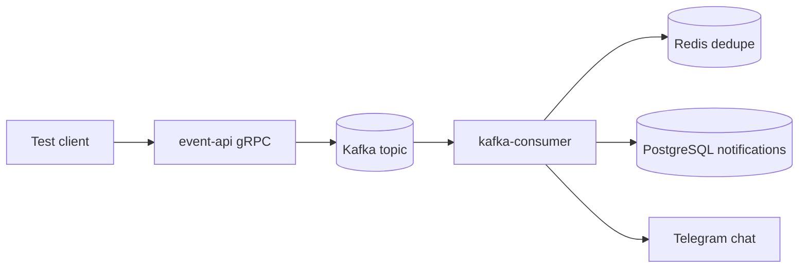
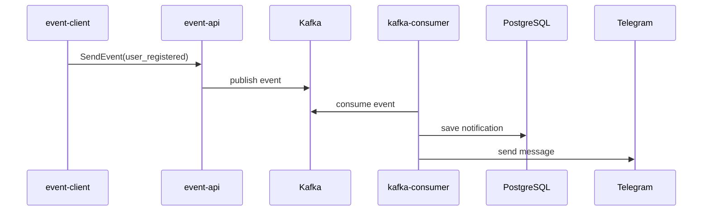

# Event-Driven Notification Platform

[](https://go.dev/)
[](https://kafka.apache.org/)
[](https://docs.docker.com/compose/)
[](https://core.telegram.org/bots/api)
[](https://github.com/denterion/Event-Driven-Notification-Platfrom/actions/workflows/ci.yml)

Event-driven notification service written in Go. The project accepts events over gRPC, publishes them to Kafka, consumes them, stores notifications in PostgreSQL, deduplicates events with Redis, and sends notification messages to Telegram.

## Presentation

This project demonstrates a production-style notification pipeline with separate API, queue, consumer, storage, deduplication, and delivery layers. It is designed as a compact portfolio project: easy to run locally, easy to test, and clear enough to explain in an interview or on a GitHub profile.

### Highlights

- Event ingestion through gRPC
- Kafka-based asynchronous processing
- PostgreSQL notification storage
- Redis event deduplication
- Telegram delivery through Bot API
- Multi-service Docker Compose environment
- Static Go Docker image without a Debian runtime layer
- GitHub Actions CI for Go tests and Docker builds

### Architecture



### Demo Flow



## Stack

- Go 1.25
- gRPC
- Kafka
- PostgreSQL
- Redis
- Telegram Bot API
- Docker Compose

## ENG

### What It Does

1. `event-api` starts a gRPC server on port `50051`.
2. A client sends an event to `event-api`.
3. `event-api` publishes the event to Kafka topic `notifications.events`.
4. `kafka-consumer` reads the event from Kafka.
5. The consumer saves a notification to PostgreSQL.
6. The consumer sends a message to Telegram.

### Supported Events

| Event | Telegram notification purpose |
| --- | --- |
| `user_registered` | New user registration |
| `order_created` | New order created |
| `payment_succeeded` | Successful payment |
| `payment_failed` | Failed payment |
| `password_reset_requested` | Password reset request |

### Requirements

- Docker and Docker Compose
- Go 1.25 or newer, if you want to run commands locally
- Telegram bot token
- Telegram chat ID

### Telegram Setup

1. Open Telegram and create a bot with `@BotFather`.
2. Copy the bot token.
3. Start a chat with your bot and send any message to it.
4. Get your chat ID.

You can get the chat ID by opening this URL in a browser after sending a message to the bot:

```text
https://api.telegram.org/bot<TELEGRAM_BOT_TOKEN>/getUpdates
```

Find `chat.id` in the response and use it as `TELEGRAM_CHAT_ID`.

### Environment

Create `.env` from the example:

```powershell
Copy-Item .env.example .env
```

Set your Telegram values:

```env
TELEGRAM_BOT_TOKEN=your_bot_token
TELEGRAM_CHAT_ID=your_chat_id
```

### Run With Docker Compose

```powershell
docker compose up --build
```

This starts Kafka, Zookeeper, PostgreSQL, Redis, `event-api`, and `kafka-consumer`.

### Send Test Events

In another terminal:

```powershell
go run ./cmd/event-client
```

Expected result:

- the client prints `event accepted` for each test event
- rows are created in the `notification` table
- Telegram messages are delivered to the configured chat

### Troubleshooting

If `docker compose up --build` fails while downloading Docker image layers with a TLS or network error, run the command again. If `docker compose up -d` starts all containers after that, the service is already running from available local images.

If `go run ./cmd/event-api` prints `bind: Only one usage of each socket address`, port `50051` is already used. This is expected when the Docker `event-api` container is running. Use the container or stop it first:

```powershell
docker compose stop event-api
```

If you changed Go code but Docker still shows old payloads, rebuild the containers after the network issue is gone:

```powershell
docker compose up --build
```

Run only one consumer with the same consumer group when testing. If both Docker `kafka-consumer` and local `go run ./cmd/kafka-consumer` are running, Kafka can split messages between them.

### Local Commands

Run the gRPC API locally:

```powershell
go run ./cmd/event-api
```

Run the Kafka consumer locally:

```powershell
go run ./cmd/kafka-consumer
```

Run the test client:

```powershell
go run ./cmd/event-client
```

## RU

### Что Делает Проект

1. `event-api` запускает gRPC-сервер на порту `50051`.
2. Клиент отправляет событие в `event-api`.
3. `event-api` публикует событие в Kafka topic `notifications.events`.
4. `kafka-consumer` читает событие из Kafka.
5. Consumer сохраняет уведомление в PostgreSQL.
6. Consumer отправляет сообщение в Telegram.

### Поддерживаемые События

| Событие | Назначение уведомления в Telegram |
| --- | --- |
| `user_registered` | Регистрация нового пользователя |
| `order_created` | Создание нового заказа |
| `payment_succeeded` | Успешная оплата |
| `payment_failed` | Ошибка оплаты |
| `password_reset_requested` | Запрос на сброс пароля |

### Требования

- Docker и Docker Compose
- Go 1.25 или новее, если нужно запускать команды локально
- Telegram bot token
- Telegram chat ID

### Настройка Telegram

1. Откройте Telegram и создайте бота через `@BotFather`.
2. Скопируйте token бота.
3. Откройте чат с ботом и отправьте ему любое сообщение.
4. Получите chat ID.

Chat ID можно получить по URL после отправки сообщения боту:

```text
https://api.telegram.org/bot<TELEGRAM_BOT_TOKEN>/getUpdates
```

Найдите `chat.id` в ответе и укажите его в `TELEGRAM_CHAT_ID`.

### Переменные Окружения

Создайте `.env` из примера:

```powershell
Copy-Item .env.example .env
```

Укажите данные Telegram:

```env
TELEGRAM_BOT_TOKEN=your_bot_token
TELEGRAM_CHAT_ID=your_chat_id
```

### Запуск Через Docker Compose

```powershell
docker compose up --build
```

Команда запускает Kafka, Zookeeper, PostgreSQL, Redis, `event-api` и `kafka-consumer`.

### Отправка Тестовых Событий

В другом терминале:

```powershell
go run ./cmd/event-client
```

Ожидаемый результат:

- клиент выводит `event accepted` для каждого тестового события
- в таблице `notification` появляются записи
- в Telegram приходят сообщения в указанный чат

### Решение Частых Проблем

Если `docker compose up --build` падает во время скачивания Docker image layers с TLS или network error, запустите команду еще раз. Если после этого `docker compose up -d` запускает все контейнеры, сервис уже работает из локальных образов.

Если `go run ./cmd/event-api` выводит `bind: Only one usage of each socket address`, порт `50051` уже занят. Это нормально, когда Docker container `event-api` уже запущен. Используйте контейнер или сначала остановите его:

```powershell
docker compose stop event-api
```

Если вы изменили Go code, но Docker все еще показывает старые payloads, пересоберите контейнеры после решения network error:

```powershell
docker compose up --build
```

Для теста запускайте только один consumer с тем же consumer group. Если одновременно работают Docker `kafka-consumer` и локальный `go run ./cmd/kafka-consumer`, Kafka может распределять сообщения между ними.

### Локальные Команды

Запустить gRPC API локально:

```powershell
go run ./cmd/event-api
```

Запустить Kafka consumer локально:

```powershell
go run ./cmd/kafka-consumer
```

Запустить тестовый клиент:

```powershell
go run ./cmd/event-client
```

## Environment Variables

| Variable | Description | Default |
| --- | --- | --- |
| `DB_HOST` | PostgreSQL host | `localhost` |
| `DB_PORT` | PostgreSQL port for local run | `5433` |
| `DB_USER` | PostgreSQL user | `notification` |
| `DB_PASSWORD` | PostgreSQL password | `notification` |
| `DB_NAME` | PostgreSQL database | `notification_db` |
| `DB_SSLMODE` | PostgreSQL SSL mode | `disable` |
| `KAFKA_BROKER` | Kafka broker address | `localhost:9092` |
| `KAFKA_TOPIC` | Kafka topic | `notifications.events` |
| `KAFKA_GROUP_ID` | Kafka consumer group | `test-consumer-group` |
| `REDIS_ADDR` | Redis address | `localhost:6379` |
| `REDIS_PASSWORD` | Redis password | empty |
| `REDIS_DB` | Redis database number | `0` |
| `TELEGRAM_BOT_TOKEN` | Telegram bot token | required |
| `TELEGRAM_CHAT_ID` | Telegram chat ID | required |

## Project Structure

```text
api/proto                 gRPC protobuf files
cmd/event-api             gRPC event API
cmd/kafka-consumer        Kafka consumer and notification sender
cmd/event-client          test client
internal/delivery         Telegram delivery
internal/kafka            Kafka producer and consumer
internal/notification     notification handler and repository
internal/postgres         PostgreSQL connection and table initialization
internal/redis            Redis client
```
